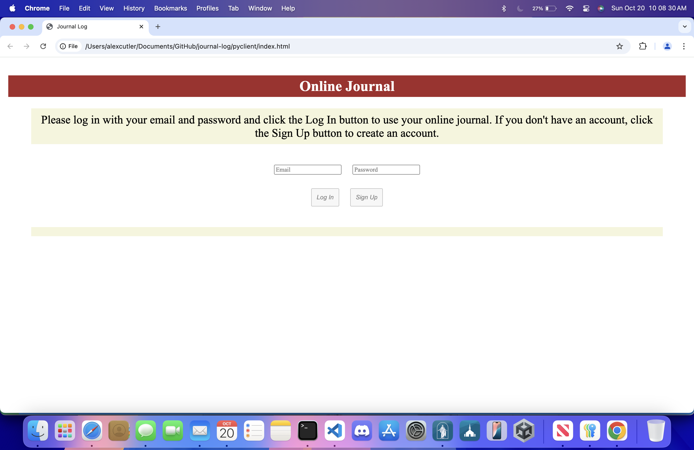
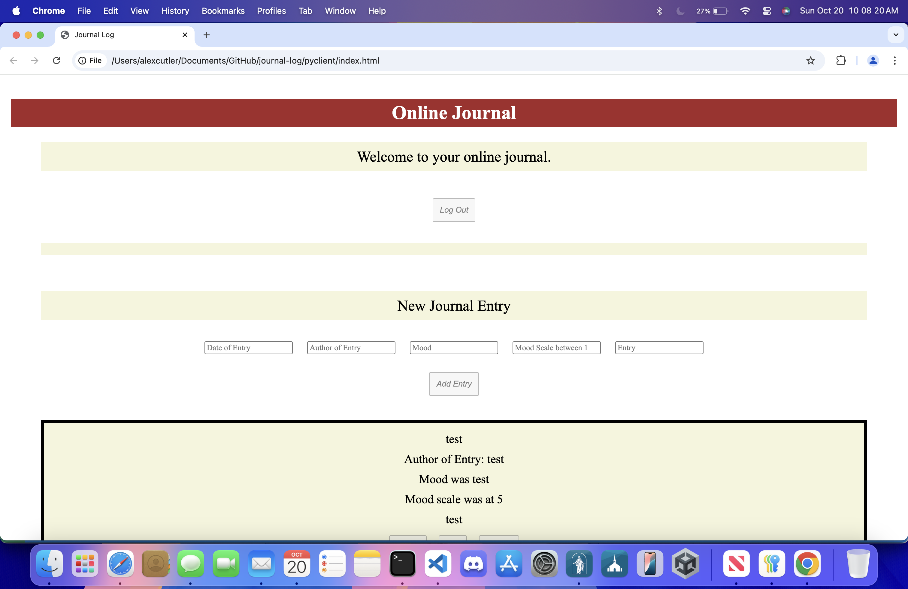

# Journal Log

This is a project I developed through most of my SE-3200 Web Application Development 1 class.  It is a basic journal web application where users can log on and add journal entries.  The backend uses the Python Flask micro web framework as the server and SQLite 3 for the database.  The frontend uses vanilla Javascript for interactivity and HTML and CSS for styling.

