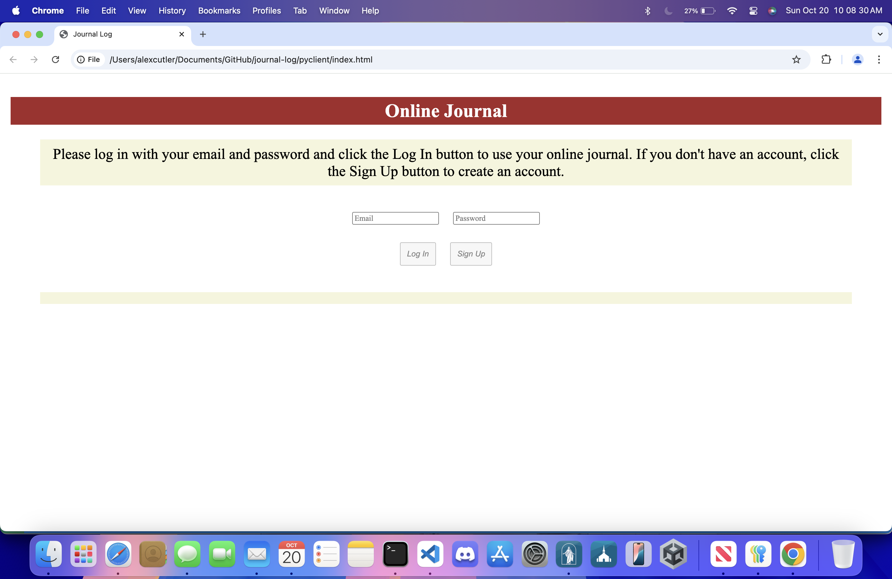
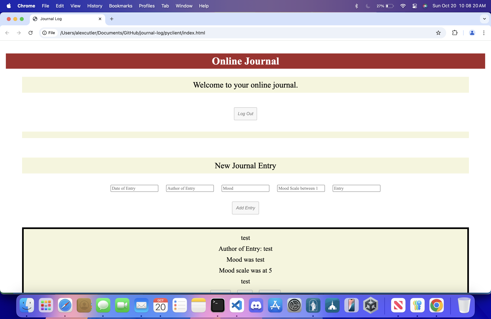

# Journal Log

This is a project I developed through most of my SE-3200 Web Application Development 1 class.  It is a basic journal web application where users can log on and add journal entries.  The backend uses the Python Flask micro web framework as the server and SQLite 3 for the database.  The frontend uses vanilla Javascript for interactivity and HTML and CSS for styling.





## Resources

**Journal Entry**

Attributes:
- date (string)
- entry (string)
- author (string)
- mood (string)
- mood scale (integer)

**User**

Attributes:
- First Name (string)
- Last Name (string)
- Email (string)
- Password (string)

## Schemas

```sql
CREATE TABLE journal_entries (id INTEGER PRIMARY KEY, date TEXT, entry TEXT, author TEXT, mood TEXT, mood_scale INTEGER);
```
```sql
CREATE TABLE users (id INTEGER PRIMARY KEY, first_name TEXT, last_name TEXT, email TEXT, password TEXT);
```

## REST Endpoints

| Name                              | Method | Path                |
| --------------------------------- | ------ | ------------------- |
| Retrieve journal entry collection | GET    | /journal_entries    |
| Retrieve journal entry member     | GET    | /journal_entries/id |
| Create journal entry member       | POST   | /journal_entries    |
| Update journal entry member       | PUT    | /journal_entries/id |
| Delete journal entry member       | DELETE | /journal_entries/id |
| Create user member                | POST   | /users              |
| Create user session               | POST   | /sessions           |
| Delete user session               | DELETE | /sessions           |

## Password Hashing

Bcrypt password hashing